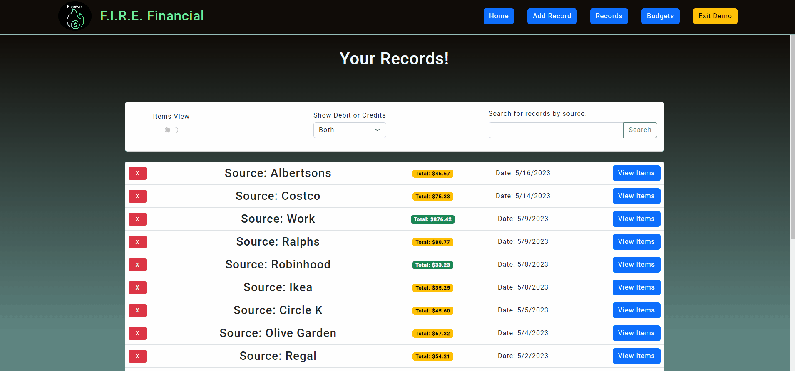

# Fire Financial

A full stack JavaScript React app for personal finance tracking.

## Why I Built This

My wife introduced me to a book called "Your Money or Your Life" by Vicki Robin and Joe Dominguez.
This book teaches the importance of knowing where ever penny in your life comes from and goes.
I built this app to help me keep track of where and what I spend my money on.

## Technologies Used

- React.js
- Bootstrap 5
- React Boostrap
- Node.js
- PostgreSQL
- HTML5
- CSS3
- Azure
- Express
- Webpack

## Live Demo

Try the application live at firefinancial.azurewebsites.net .

## Features

- Users can see their monthly income and expenditures.
- Users can add new records to their account.
- Users can view, filter and search through their records.
- Users can set, update and keep track of budget goals for different categories.

## Preview

<>

## Development

### System Requirements

- Node.js 10 or higher
- NPM 6 or higher
- PostgreSQL 14 or higher
